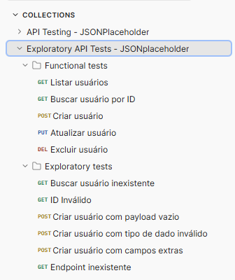
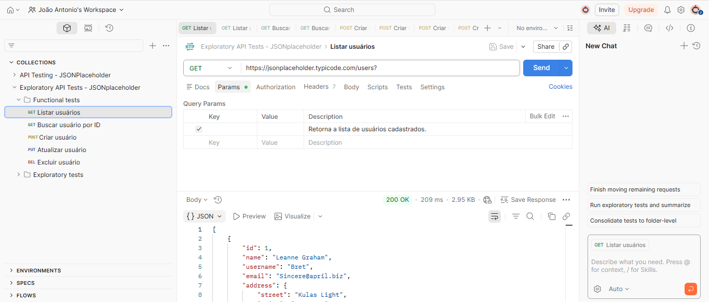
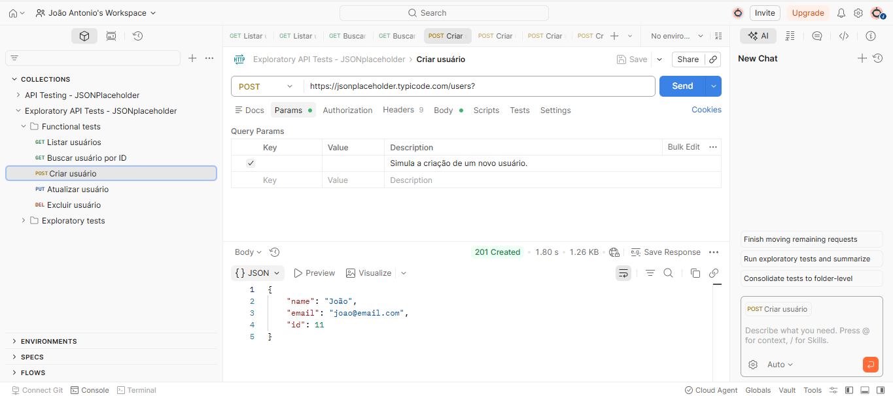
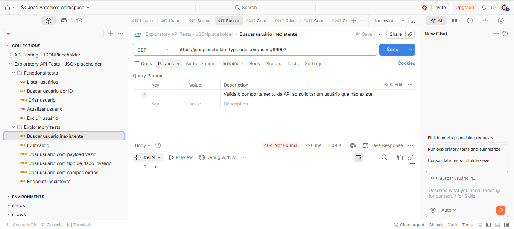
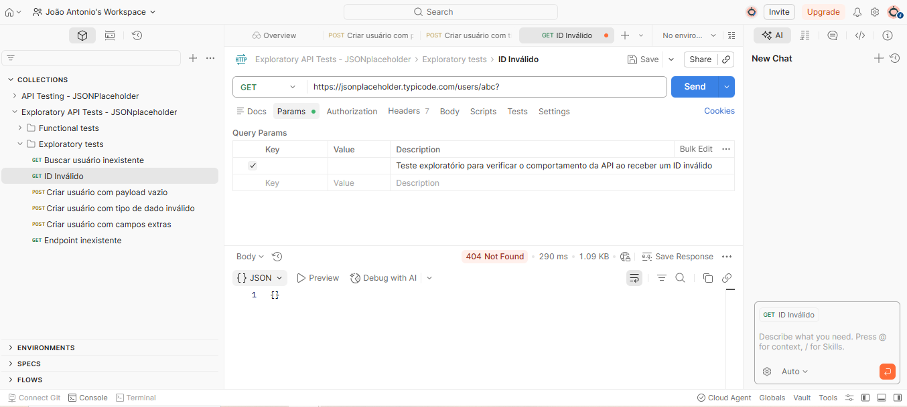
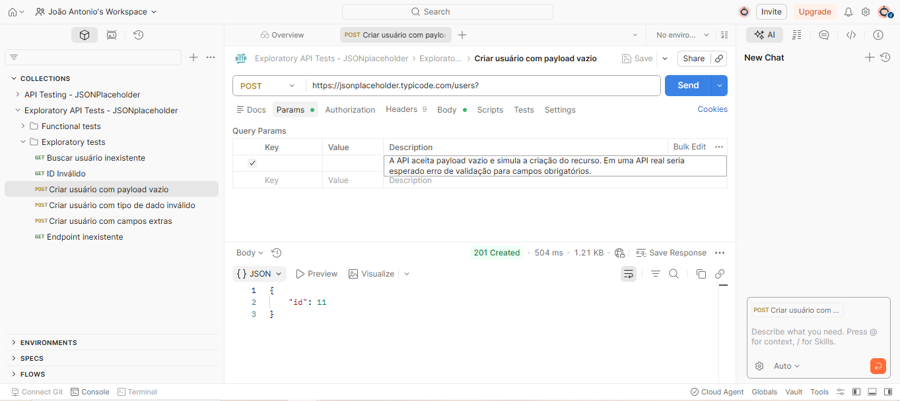
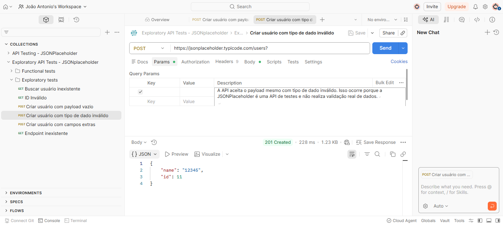
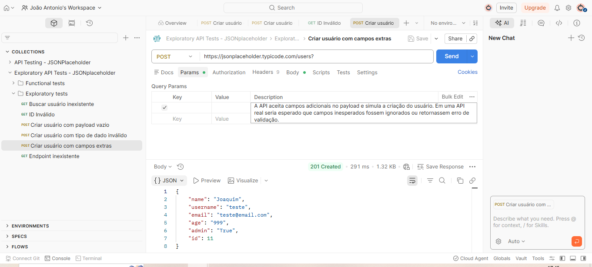
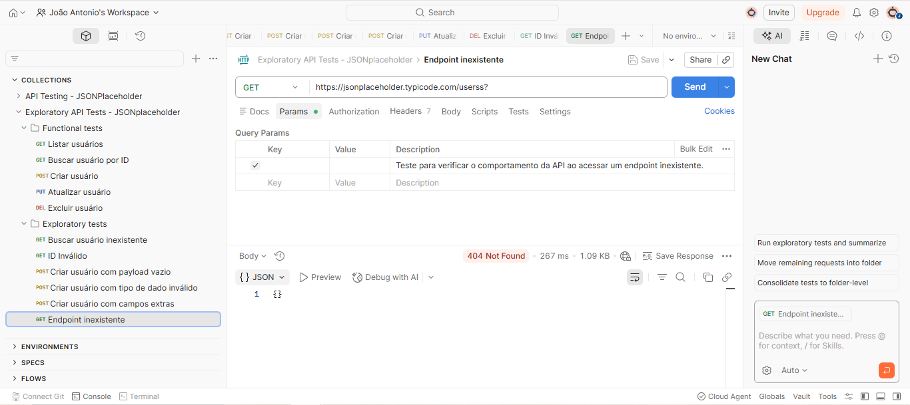

# 🧪 Exploratory API Tests - JSONPlaceholder

Este projeto foi desenvolvido como parte dos meus estudos para atuar como QA (Quality Assurance).

O objetivo é demonstrar na prática a execução de testes em API, com foco principal em **testes exploratórios**, analisando o comportamento da API em cenários positivos, negativos e inesperados.

API utilizada:
https://jsonplaceholder.typicode.com

---

## 🎯 Objetivo do projeto

- Validar o comportamento da API
- Explorar cenários não previstos
- Identificar falhas e comportamentos inesperados
- Praticar análise crítica de respostas

---

## 🧪 Tipos de testes realizados

### ✔ Testes Funcionais
- Listagem de usuários
- Busca de usuário por ID
- Criação de usuário
- Atualização de usuário
- Exclusão de usuário

### 🔎 Testes Exploratórios
- Usuário inexistente
- ID inválido
- Payload vazio
- Tipo de dado inválido
- Campos extras
- Endpoint inexistente

---

## 🔎 Endpoints testados

### 🟢 Funcionais

GET /users  
→ Esperado: 200 OK  

GET /users/1  
→ Esperado: 200 OK  

POST /users  
→ Esperado: 201 Created  

Exemplo de payload:
{
  "name": "João",
  "username": "teste",
  "email": "teste@email.com"
}

PUT /users/1  
→ Esperado: 200 OK  

DELETE /users/1  
→ Esperado: 200 OK  

---

### 🔍 Exploratórios

GET /users/9999  
→ Esperado: 404 Not Found  

GET /users/abc  
→ Verificar comportamento para ID inválido  

POST /users (payload vazio)  
→ Observado: API aceita requisição sem validação  

POST /users (tipo inválido)  
Payload:
{
  "name": 12345
}
→ Observado: API não valida tipo de dado  

POST /users (campos extras)  
Payload:
{
  "name": "João",
  "age": 999,
  "admin": true
}
→ Observado: API aceita campos extras  

GET /userss  
→ Esperado: 404 Not Found  

---

## 📸 Evidências dos testes

### 🧩 Estrutura da Collection

---

### 🟢 Testes Funcionais

Listagem de usuários  

Criação de usuário  

---

### 🔎 Testes Exploratórios

Usuário inexistente  

ID inválido  

Payload vazio  

Tipo de dado inválido  

Campos extras  

Endpoint inexistente  

---

## 🧠 Observações importantes

- A API não possui validações robustas
- Permite envio de dados inválidos
- Aceita campos não previstos
- Retorna corretamente 404 para endpoints inexistentes

---

## 📂 Estrutura do projeto

README.md  
exploratory-test-charter  
test-notes  
bug-report  
postman-collection  
evidences  

---

## 🚀 Considerações finais

Embora testes funcionais tenham sido realizados para validação básica, o foco principal deste projeto foi a aplicação de **testes exploratórios em API**.

Este projeto demonstra minha capacidade de:

- Pensamento crítico
- Criação de cenários de teste
- Análise de comportamento de APIs
- Documentação de testes
